# SOW Generator AI Agent - Implementation Plan

A production-grade AI agent for automating Statement of Work (SOW) generation, review, client research, and product research.

## Important Notes

> **Mock Data Approach**: This plan uses realistic fake data for CRM, clients, products, and SOWs. No real integrations with SharePoint, CRM, or other enterprise systems are included in this prototype.

> **AWS Costs**: Running Bedrock, OpenSearch Serverless, and ECS will incur AWS costs. Estimated dev/test costs: ~$50-100/month. Production will be higher based on usage.

---

## Agent Architecture: 1 Brain + 4 Tool Groups

The agent is designed as **1 Planner (the "brain")** that orchestrates **4 specialized tool groups**:

```mermaid
graph TB
    USER["👤 USER REQUESTS<br/><br/>• Create SOW for Client X<br/>• Review this SOW document<br/>• Research Client Y background<br/>• What products fit this scope?"]
    
    PLANNER["🧠 PLANNER / ORCHESTRATOR<br/><br/>• Understands user requests<br/>• Breaks tasks into steps<br/>• Decides which tools to call<br/>• Synthesizes final response"]
    
    RESEARCH["🔍 RESEARCH TOOLS<br/><br/>search_crm<br/>search_product_kb<br/>search_historical_sows"]
    CONTEXT["📋 CONTEXT TOOLS<br/><br/>assemble_context<br/>assemble_client_brief"]
    CONTENT["✍️ CONTENT TOOLS<br/><br/>generate_sow_draft<br/>revise_section<br/>generate_summary<br/>export_docx"]
    COMPLIANCE["✅ COMPLIANCE TOOLS<br/><br/>check_mandatory_clauses<br/>check_prohibited_terms<br/>generate_report"]
    UTILS["🛠️ UTILITIES<br/><br/>parse_document (PDF/DOCX)<br/>export_sow (DOCX)"]
    
    USER --> PLANNER
    PLANNER --> RESEARCH
    PLANNER --> CONTEXT
    PLANNER --> CONTENT
    PLANNER --> COMPLIANCE
    PLANNER --> UTILS

    style USER fill:#34495e,stroke:#2c3e50,color:#fff
    style PLANNER fill:#4a90d9,stroke:#2d5a87,color:#fff
    style RESEARCH fill:#f5a623,stroke:#c17f1a,color:#fff
    style CONTEXT fill:#7ed321,stroke:#5a9a17,color:#fff
    style CONTENT fill:#9b59b6,stroke:#7b3d96,color:#fff
    style COMPLIANCE fill:#e74c3c,stroke:#c0392b,color:#fff
    style UTILS fill:#95a5a6,stroke:#7f8c8d,color:#fff
```



### Component Responsibilities

| Component | Role | File |
|-----------|------|------|
| **Planner** | Orchestrates workflow, decides tool order | `planner.py` |
| **Research Tools** | Fetches data from CRM, KB, historical docs | `tools/research.py` |
| **Context Tools** | Assembles relevant info into coherent package | `tools/context.py` |
| **Content Tools** | Generates SOW sections, summaries, text | `tools/content.py` |
| **Compliance Tools** | Validates output against rules | `tools/compliance.py` |
| **Utilities** | Document parsing (ingest) and DOCX export | `utils/doc_handler.py` |

---

### Example Flow: SOW Creation

```mermaid
sequenceDiagram
    participant User
    participant Planner as 🧠 Planner
    participant Research as 🔍 Research
    participant Context as 📋 Context
    participant Content as ✍️ Content
    participant Compliance as ✅ Compliance
    
    User->>Planner: Create SOW for Client X, Product Y
    Planner->>Research: search_crm("Client X")
    Research-->>Planner: Client profile
    Planner->>Research: search_product_kb("Product Y")
    Research-->>Planner: Product specs
    Planner->>Research: search_historical_sows("Client X", "Product Y")
    Research-->>Planner: Similar past SOWs
    Planner->>Context: assemble_context(client, product, history)
    Context-->>Planner: Working context package
    Planner->>Content: generate_sow_draft(context)
    Content-->>Planner: SOW draft
    Planner->>Compliance: check_compliance(draft)
    Compliance-->>Planner: Issues found
    Planner->>Content: revise_section(issue)
    Content-->>Planner: Revised SOW
    Planner-->>User: Final SOW
```



---

## Solution Architecture Overview

```mermaid
graph TB
    subgraph UI["🖥️ User Interface"]
        STREAMLIT[Streamlit Web App]
    end
    
    subgraph API["⚡ API Layer"]
        FASTAPI[FastAPI Backend]
    end
    
    subgraph AGENT["🤖 Agent Layer"]
        PLANNER[Planner/Orchestrator]
        TOOLS[Agent Tools]
        PROMPTS[Versioned Prompts]
    end
    
    subgraph LLM["🧠 LLM"]
        BEDROCK[Amazon Bedrock<br/>Claude]
    end
    
    subgraph RAG["🔍 RAG Pipeline"]
        OPENSEARCH[OpenSearch<br/>Vector Store]
        EMBEDDINGS[Titan Embeddings]
    end
    
    subgraph DATA["💾 Data Layer"]
        S3[S3 Documents]
        DDB[DynamoDB<br/>Audit Logs]
        MOCK[Mock Data<br/>JSON/MD]
    end
    
    STREAMLIT --> FASTAPI
    FASTAPI --> PLANNER
    PLANNER --> TOOLS
    PLANNER --> PROMPTS
    PLANNER --> BEDROCK
    TOOLS --> OPENSEARCH
    OPENSEARCH --> EMBEDDINGS
    TOOLS --> MOCK
    FASTAPI --> DDB
    TOOLS --> S3
```



---

## Project Structure

```
sow-generator/
├── .github/workflows/
│   ├── ci.yml                 # Lint, test, eval on every PR
│   ├── cd-dev.yml             # Deploy to dev on merge to main
│   └── cd-prod.yml            # Deploy to prod (manual trigger)
│
├── src/
│   ├── agent/
│   │   ├── planner.py             # 🧠 Main orchestrator (the brain)
│   │   ├── tools/
│   │   │   ├── research.py        # 🔍 CRM, KB search tools
│   │   │   ├── context.py         # 📋 Context assembly tools
│   │   │   ├── content.py         # ✍️ SOW generation tools
│   │   │   └── compliance.py      # ✅ Compliance checking tools
│   │   ├── utils/
│   │   │   └── doc_handler.py     # 🛠️ PDF/DOCX Parsing & Export
│   │   └── prompts/
│   │       ├── planner.yaml
│   │       ├── sow_generator.yaml
│   │       └── compliance_checker.yaml
│   ├── rag/
│   │   ├── embeddings.py
│   │   ├── retriever.py
│   │   └── indexer.py
│   ├── api/
│   │   ├── main.py
│   │   └── schemas.py
│   └── ui/
│       └── streamlit_app.py
│
├── data/
│   ├── mock_crm.json
│   ├── mock_opportunities.json
│   ├── templates/
│   ├── historical_sows/
│   ├── product_kb/
│   └── compliance_rules/
│
├── tests/
│   ├── unit/
│   ├── integration/
│   └── evals/
│
├── infra/
│   ├── terraform/
│   └── docker/
│
├── scripts/
├── pyproject.toml
├── Makefile
└── README.md
```


---

## Implementation Phases

### Phase 1: Project Setup & Mock Data (3-4 days)
- Initialize project structure
- Create mock data schemas
- Generate realistic fake data (3 clients, 3 products, 5 historical SOWs)
- Set up development environment (Docker, dependencies)

#### Mock Data Schemas

**Clients (mock_crm.json)**:
```json
{
  "clients": [
    {
      "id": "CLIENT-001",
      "name": "Acme Financial Services",
      "industry": "Banking",
      "size": "Enterprise",
      "relationship_since": "2020",
      "contacts": [
        {"name": "Jane Smith", "role": "CTO", "email": "jane.smith@acme.com"},
        {"name": "Bob Chen", "role": "Procurement Manager", "email": "bob.chen@acme.com"}
      ],
      "notes": "Prefers fixed-price contracts. Previous SLA issue in 2021 - now resolved.",
      "compliance_tier": "HIGH"
    }
  ]
}
```

**Products**: Real-Time Payments Platform, Fraud Detection Suite, Data Analytics Platform

**Historical SOWs**: 3-5 realistic fake SOWs with proper structure

**Compliance Rules**: Mandatory clauses, prohibited terms, SLA requirements

---

### Phase 2: Core Agent Implementation (5-7 days)

#### Research Tools (`tools/research.py`)
- `search_crm(client_name: str)` - Search mock CRM for client data
- `search_opportunities(client_id: str)` - Get past opportunities
- `search_historical_sows(client_id: str, product: str)` - Find similar past SOWs
- `search_product_kb(product: str)` - Get product documentation
- `search_compliance_kb(product: str, client_tier: str)` - Get compliance requirements

#### Content Tools (`tools/content.py`)
- `generate_sow_draft(context: dict, template: str)` - Generate full SOW
- `generate_section(section_name: str, context: dict)` - Generate specific section
- `revise_section(section: str, feedback: str)` - Revise based on feedback
- `generate_summary(documents: list)` - Summarize retrieved documents

#### Compliance Tools (`tools/compliance.py`)
- `check_mandatory_clauses(sow_text: str, requirements: list)` - Check required clauses
- `check_prohibited_terms(sow_text: str)` - Check for prohibited language
- `check_sla_requirements(sow_text: str, product: str)` - Validate SLA terms
- `generate_compliance_report(findings: list)` - Create compliance report

#### Sample Planner Prompt (`prompts/planner.yaml`)
```yaml
name: planner
version: "1.0.0"
description: Main orchestrator prompt for SOW Generator agent

system_prompt: |
  You are an AI assistant that helps create and review Statements of Work (SOWs).
  
  Your workflow for SOW creation:
  1. Research the client using search_crm and search_opportunities
  2. Research the product using search_product_kb
  3. Find similar historical SOWs using search_historical_sows
  4. Get compliance requirements using search_compliance_kb
  5. Generate the SOW draft using generate_sow_draft
  6. Check compliance using check_mandatory_clauses and check_prohibited_terms
  7. Revise if needed, then present the final SOW
  
  Always cite your sources and explain your reasoning.
```

#### RAG Pipeline (`src/rag/`)
- **embeddings.py**: Bedrock Titan embeddings wrapper
- **indexer.py**: Document chunking and indexing to OpenSearch
- **retriever.py**: Semantic search over indexed documents

---

### Phase 3: UI & API (3-4 days)

#### FastAPI Endpoints (`src/api/main.py`)
- `POST /api/v1/sow/create` - Create new SOW
- `POST /api/v1/sow/review` - Review uploaded SOW
- `POST /api/v1/research/client` - Client research
- `POST /api/v1/research/product` - Product research
- `GET /api/v1/health` - Health check

#### Streamlit UI Pages (`src/ui/streamlit_app.py`)
- **Home**: Overview and quick actions
- **Create SOW**: Form for client/product selection, generates SOW
- **Review SOW**: Upload SOW for compliance review
- **Research**: Client and product research interface
- **History**: Past generations and audit trail

---

### Phase 4: Testing Framework (3-4 days)

#### Unit Tests (`tests/unit/`)
- Tool functions (mocked LLM calls)
- Prompt template loading
- Data parsing utilities
- API schemas

#### Integration Tests (`tests/integration/`)
- Full tool chains with mocked LLM
- API endpoint flows
- RAG pipeline (index → retrieve)

#### LLM Evaluation Suite (`tests/evals/`)
- Format compliance (does output have required sections?)
- Factual accuracy (are facts from retrieved docs?)
- Hallucination rate (are there made-up facts?)
- Instruction following (did it follow the prompt?)

---

### Phase 5: CI/CD Pipeline (2-3 days)

#### CI Pipeline (`ci.yml`) - runs on every PR:
```yaml
jobs:
  lint:
    - ruff check
    - black --check
    - mypy src/
  test:
    - pytest tests/unit/
    - pytest tests/integration/
  eval:
    - python scripts/run_evals.py --subset ci
    - Compare to baseline metrics
    - Fail if regression detected
```

#### CD Pipeline (`cd-dev.yml`) - runs on merge to main:
- Build Docker image
- Push to ECR
- Deploy to dev ECS cluster
- Run smoke tests

---

### Phase 6: AWS Deployment (4-5 days)

#### Terraform Modules (`infra/terraform/`)
- **VPC**: Networking
- **ECS**: Fargate cluster and service
- **ECR**: Container registry
- **API Gateway**: REST API
- **OpenSearch Serverless**: Vector store
- **DynamoDB**: Audit logs
- **S3**: Document storage
- **IAM**: Roles and policies
- **CloudWatch**: Logs and metrics

Environment separation via Terraform workspaces: `dev`, `staging`, `prod`

---

## Verification Plan

### Automated Tests

| Test Type | Command | Coverage |
|-----------|---------|----------|
| Unit Tests | `pytest tests/unit/ -v` | Tool logic, utilities, parsing |
| Integration Tests | `pytest tests/integration/ -v` | Full flows with mocked LLM |
| LLM Evals | `python scripts/run_evals.py` | Output quality metrics |
| Lint | `ruff check src/ tests/` | Code style |
| Type Check | `mypy src/` | Type safety |

### Manual Verification

1. **Local Development Test**:
   - Run `make dev` to start local environment
   - Open Streamlit at `http://localhost:8501`
   - Create a SOW for "Acme Financial" + "Real-Time Payments"
   - Verify SOW contains client info, product details, compliance clauses
   - Verify audit log is created

2. **AWS Deployment Test**:
   - Run `terraform apply` for dev environment
   - Access API via API Gateway URL
   - Trigger SOW generation via API
   - Verify CloudWatch logs contain request traces
   - Verify DynamoDB has audit entries

---

## Tech Stack

| Layer | Technology |
|-------|------------|
| Language | Python 3.11+ |
| Agent Framework | LangGraph |
| LLM | Amazon Bedrock (Claude 3.5 Sonnet) |
| Embeddings | Amazon Titan Embeddings |
| Vector Store | OpenSearch Serverless (local: ChromaDB) |
| API | FastAPI |
| UI | Streamlit |
| Testing | pytest + custom LLM evals |
| CI/CD | GitHub Actions |
| Infrastructure | Terraform |
| Compute | ECS Fargate |
| Logging | CloudWatch |
| Audit | DynamoDB |

---

## Estimated Timeline

| Phase | Duration | Prerequisites |
|-------|----------|---------------|
| Phase 1: Setup & Mock Data | 3-4 days | None |
| Phase 2: Core Agent | 5-7 days | Phase 1 |
| Phase 3: UI & API | 3-4 days | Phase 2 |
| Phase 4: Testing | 3-4 days | Phase 2-3 |
| Phase 5: CI/CD | 2-3 days | Phase 4 |
| Phase 6: AWS Deploy | 4-5 days | Phase 5 |
| **Total** | **3-4 weeks** | |

