# SOW Generator AI Agent

A production-grade AI agent for automating Statement of Work (SOW) generation, review, client research, and product research.

## Features

- **SOW Creation**: Generate SOW drafts using templates + context from CRM and knowledge bases
- **SOW Review**: Validate SOWs (DOCX/PDF) against compliance rules and quality criteria
- **Client Research**: Retrieve client history, contacts, and past engagements
- **Product Research**: Search product knowledge bases for features and pricing
- **Document Handling**: Ingest PDF/DOCX and export SOWs to DOCX format

---

## Agent Architecture: 1 Brain + 4 Tool Groups

The agent is designed as **1 Planner (the "brain")** that orchestrates **4 specialized tool groups**:

```mermaid
graph TB
    USER["👤 USER REQUESTS<br/><br/>• Create SOW for Client X<br/>• Review this SOW document<br/>• Research Client Y background<br/>• What products fit this scope?"]
    
    PLANNER["🧠 PLANNER / ORCHESTRATOR<br/><br/>• Understands user requests<br/>• Breaks tasks into steps<br/>• Decides which tools to call<br/>• Synthesizes final response"]
    
    RESEARCH["🔍 RESEARCH TOOLS<br/><br/>search_crm<br/>search_product_kb<br/>search_historical_sows"]
    CONTEXT["📋 CONTEXT TOOLS<br/><br/>assemble_context<br/>assemble_client_brief"]
    CONTENT["✍️ CONTENT TOOLS<br/><br/>generate_sow_draft<br/>generate_sow_draft_with_reflection<br/>revise_section<br/>generate_summary"]
    COMPLIANCE["✅ COMPLIANCE TOOLS<br/><br/>check_mandatory_clauses<br/>check_prohibited_terms<br/>generate_report"]
    UTILS["🛠️ UTILITIES<br/><br/>parse_document (PDF/DOCX)<br/>export_sow (DOCX)"]
    
    USER --> PLANNER
    PLANNER --> RESEARCH
    PLANNER --> CONTEXT
    PLANNER --> CONTENT
    PLANNER --> COMPLIANCE
    PLANNER --> UTILS

    style USER fill:#34495e,stroke:#2c3e50,color:#fff
    style PLANNER fill:#4a90d9,stroke:#2d5a87,color:#fff
    style RESEARCH fill:#f5a623,stroke:#c17f1a,color:#fff
    style CONTEXT fill:#7ed321,stroke:#5a9a17,color:#fff
    style CONTENT fill:#9b59b6,stroke:#7b3d96,color:#fff
    style COMPLIANCE fill:#e74c3c,stroke:#c0392b,color:#fff
    style UTILS fill:#95a5a6,stroke:#7f8c8d,color:#fff
```


---

### Component Responsibilities

| Component | Role | File |
|-----------|------|------|
| **Planner** | Orchestrates workflow, decides tool order | `core/planner.py` |
| **Research Tools** (5) | Fetches data from CRM, KB, historical docs | `tools/research.py` |
| **Context Tools** (2) | Assembles relevant info into coherent package | `tools/context.py` |
| **Content Tools** (5) | Generates SOW sections, hybrid reflection | `tools/content.py` |
| **Compliance Tools** (4) | Validates output against rules | `tools/compliance.py` |
| **Utilities** (2) | Document parsing (ingest) and DOCX export | `utils/doc_handler.py` |


## Tech Stack

| Layer | Technology |
|-------|------------|
| Agent Framework | LangGraph |
| LLM | Amazon Bedrock (Claude 3.5 Sonnet) |
| Vector Store | OpenSearch Serverless (local: ChromaDB) |
| API | FastAPI |
| UI | Streamlit |
| Infrastructure | Terraform + ECS Fargate |

## Project Structure

```
sow-generator/
├── src/
│   ├── agent/          # LangGraph agent + tools
│   ├── rag/            # RAG pipeline
│   ├── api/            # FastAPI backend
│   └── ui/             # Streamlit frontend
├── data/               # Mock data + templates
├── tests/              # Unit, integration, evals
└── infra/              # Terraform + Docker
```

## Quick Start

### Prerequisites

- Python 3.11+
- Docker & Docker Compose
- AWS CLI configured (for Bedrock access)

### Local Development

```bash
# Create virtual environment
python -m venv .venv
source .venv/bin/activate  # On Windows: .venv\Scripts\activate

# Install dependencies
pip install -e ".[dev]"

# Start local services (ChromaDB)
docker-compose up -d

# Run the API
uvicorn src.api.main:app --reload

# Run the UI (in another terminal)
streamlit run src/ui/streamlit_app.py
```

### Running Tests

```bash
# Unit tests
pytest tests/unit/

# Integration tests
pytest tests/integration/

# All tests with coverage
pytest --cov=src tests/
```

### Linting & Formatting

```bash
# Check code style
ruff check .
black --check .
mypy src/

# Auto-fix
ruff check --fix .
black .
```

### Docker Build

```bash
docker build -t sow-generator .
docker run -p 8000:8000 sow-generator
```

## Environment Variables

Create a `.env` file based on `.env.example`:

```bash
AWS_REGION=ap-southeast-2
AWS_PROFILE=default
BEDROCK_MODEL_ID=anthropic.claude-3-5-sonnet-20241022-v2:0
```

## Documentation

- [Implementation Plan](docs/IMPLEMENTATION_PLAN.md) - Architecture & design
- [Use Case Flows](docs/USE_CASE_FLOWS.md) - Agent workflow diagrams
- [Tasks](docs/TASKS.md) - Implementation checklist
- [Architecture Decisions](docs/ARCHITECTURE_DECISIONS.md) - Design decisions & rationale

## License

Internal use only.
