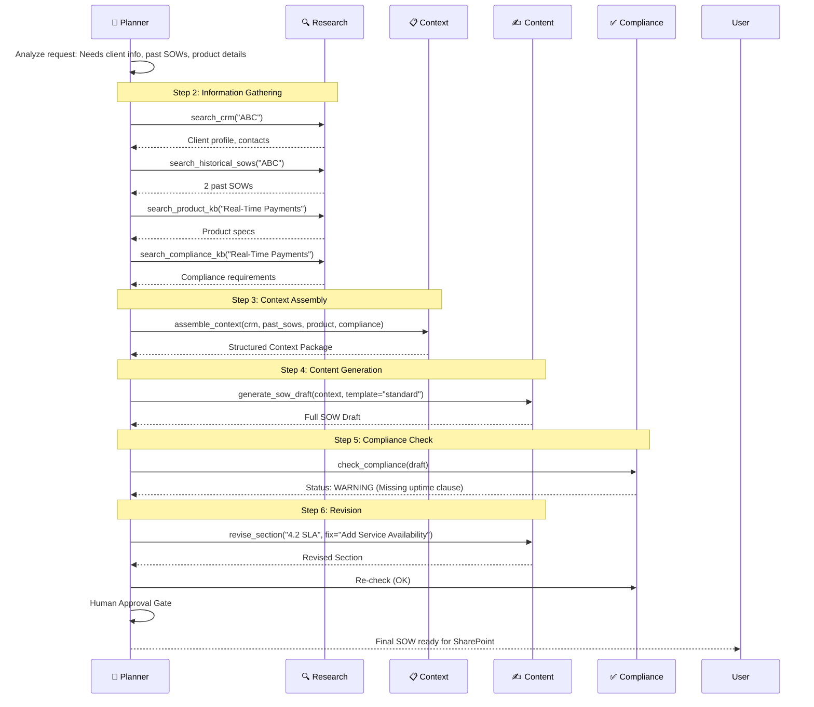
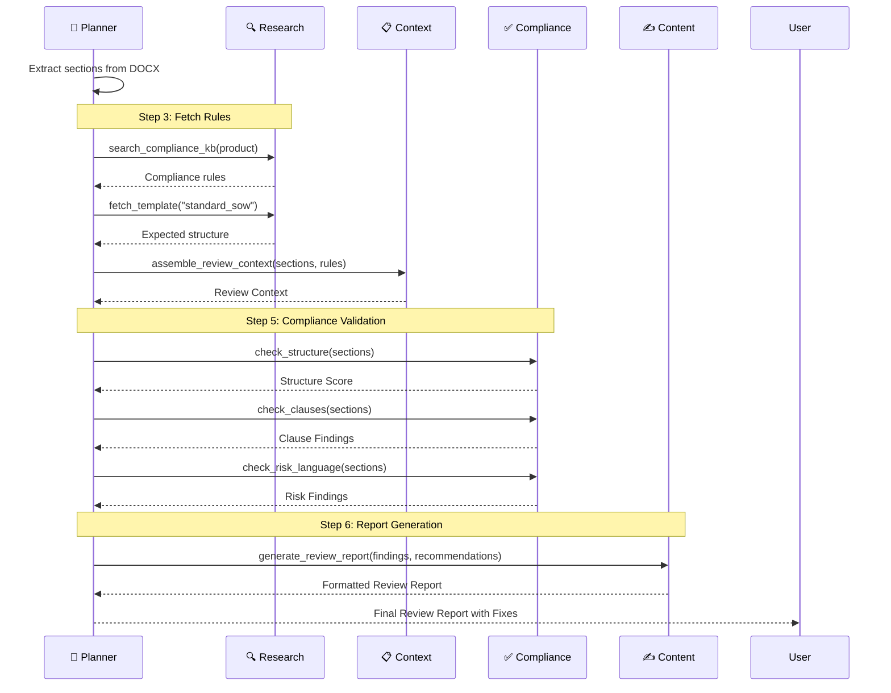
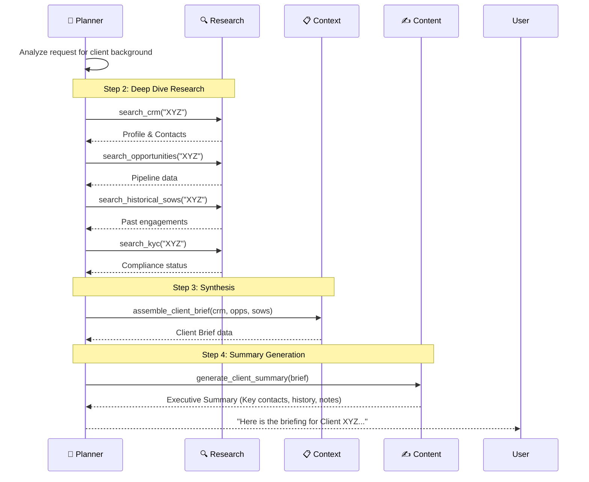
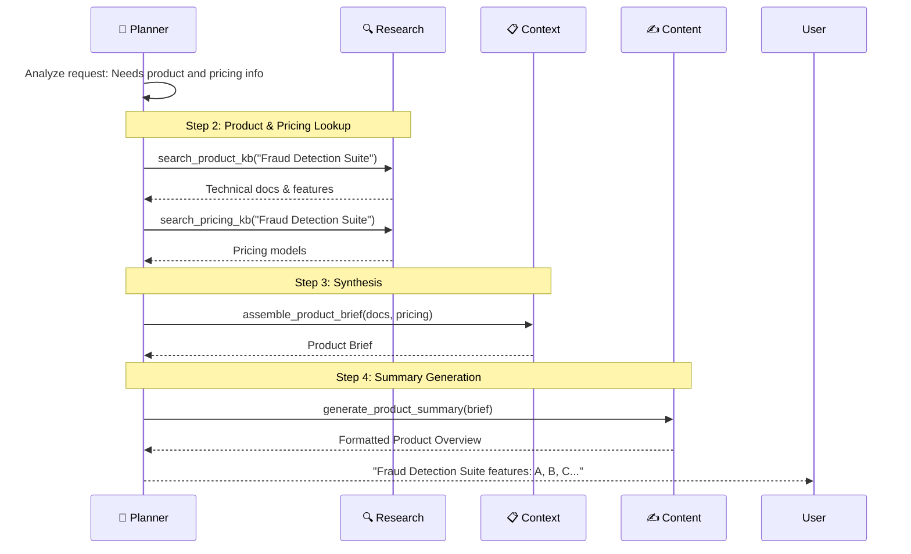

# SOW Generator - Use Case Flows

This document describes how the agent components work together for each use case.

---

## Agent Components

| Component | Role |
|-----------|------|
| 🧠 **Planner** | Orchestrates workflow, decides tool order |
| 🔍 **Research** | Fetches data from CRM, KB, historical docs |
| 📋 **Context** | Assembles relevant info into coherent package |
| ✍️ **Content** | Generates SOW sections, summaries, text |
| ✅ **Compliance** | Validates output against rules |

---

## Example 1: SOW Creation Flow

**User Request:** *"Create a SOW for Client ABC for the Real-Time Payments product"*

### Components Used

| Component | Usage |
|-----------|-------|
| Research | ✅ Heavy |
| Context | ✅ Yes |
| Content | ✅ Heavy |
| Compliance | ✅ Yes |

---

## Example 2: SOW Review Flow

**User Request:** *"Review this SOW document for compliance issues"* (upload SOW.docx)

### Components Used

| Component | Usage |
|-----------|-------|
| Research | ✅ Light |
| Context | ✅ Yes |
| Content | ✅ Light (report) |
| Compliance | ✅ Heavy |

---

## Example 3: Client Research Flow

**User Request:** *"Give me background on Client XYZ before my sales meeting"*

### Components Used

| Component | Usage |
|-----------|-------|
| Research | ✅ Heavy |
| Context | ✅ Yes |
| Content | ✅ Yes |
| Compliance | ❌ No |

---

## Example 4: Product Research Flow

**User Request:** *"What are the key features and pricing for our Fraud Detection Suite?"*

### Components Used

| Component | Usage |
|-----------|-------|
| Research | ✅ Heavy |
| Context | ✅ Light |
| Content | ✅ Yes |
| Compliance | ❌ No |

---

## Summary: Component Usage by Use Case

| Use Case | Research | Context | Content | Compliance |
|----------|:--------:|:-------:|:-------:|:----------:|
| **SOW Creation** | ✅ Heavy | ✅ Yes | ✅ Heavy | ✅ Yes |
| **SOW Review** | ✅ Light | ✅ Yes | ✅ Light | ✅ Heavy |
| **Client Research** | ✅ Heavy | ✅ Yes | ✅ Yes | ❌ No |
| **Product Research** | ✅ Heavy | ✅ Light | ✅ Yes | ❌ No |
