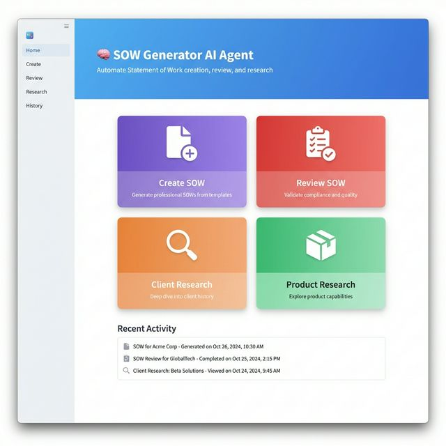
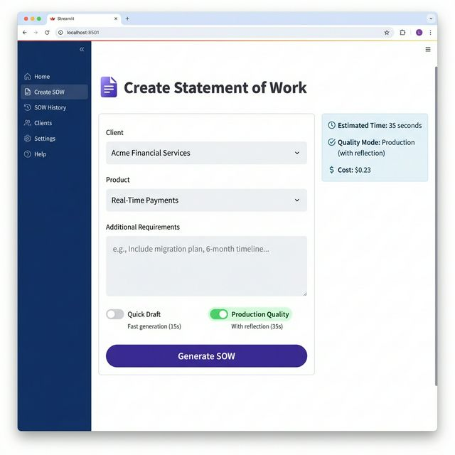
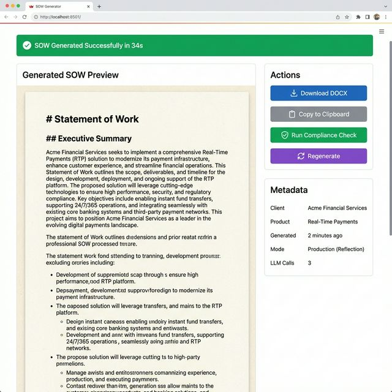
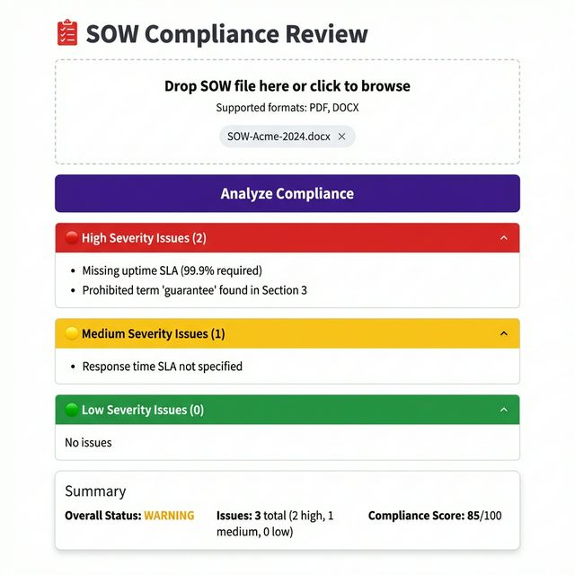
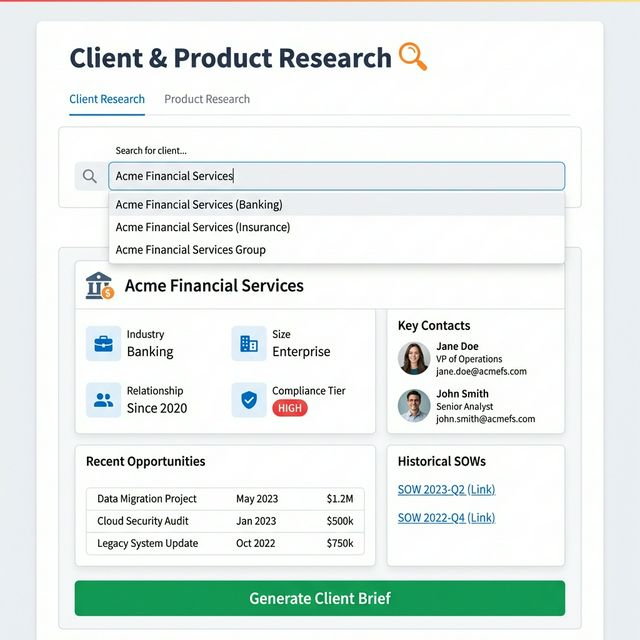

# SOW Generator - UI Design Plan

## Overview

The Streamlit UI provides a clean, professional interface for SOW creation, review, and research. The design emphasizes simplicity, clarity, and a modern aesthetic with good visual hierarchy.

---

## Page Mockups

### 1. Home / Dashboard



**Purpose**: Landing page with quick access to all features

**Elements**:
- **Header**: Blue gradient with app title and tagline
- **Action Cards** (2×2 grid):
  - Create SOW (purple)
  - Review SOW (red)
  - Client Research (orange)
  - Product Research (green)
- **Recent Activity**: List of recent generations/reviews
- **Sidebar**: Navigation menu (Home, Create, Review, Research, History)

**User Flow**: Click any action card → Navigate to respective page

---

### 2. Create SOW



**Purpose**: Form to generate new SOWs

**Elements**:
- **Form Fields**:
  - Client dropdown (populated from mock CRM)
  - Product dropdown (from product KB)
  - Additional Requirements text area
  - **Quality Mode Toggle**: 
    - Quick Draft (15s, $0.08)
    - Production Quality (35s, $0.23) ⭐
- **Info Panel** (right side):
  - Estimated time
  - Quality mode
  - Cost estimate
- **Generate Button**: Large, prominent purple button

**User Flow**: 
1. Select client + product
2. Add requirements (optional)
3. Choose quality mode
4. Click Generate
5. → Navigate to Results page

**Key Feature**: Toggle between fast draft and production-quality (reflection) modes

---

### 3. SOW Results



**Purpose**: Display generated SOW with actions

**Elements**:
- **Success Banner**: Green with generation time
- **Preview Pane** (60% width):
  - Markdown-rendered SOW content
  - Paper-like background for readability
  - Scrollable for long documents
- **Actions Panel** (40% width):
  - Download DOCX button (blue)
  - Copy to Clipboard (gray)
  - Run Compliance Check (green) → navigates to Review
  - Regenerate (purple)
- **Metadata Panel**:
  - Client, Product, Generated time
  - Mode used
  - LLM calls count

**User Flow**: 
- Review → Download or Run Compliance Check
- Can regenerate with different settings

---

### 4. Review SOW



**Purpose**: Upload and validate SOW compliance

**Elements**:
- **File Upload**:
  - Drag-and-drop area
  - Supports PDF, DOCX
  - Shows uploaded filename
- **Analyze Button**: Large purple button
- **Results** (traffic light system):
  - 🔴 **High Severity** (expandable)
  - 🟡 **Medium Severity** (expandable)
  - 🟢 **Low Severity** (expandable)
- **Summary Card**:
  - Overall status (PASS/WARNING/FAIL)
  - Issue counts by severity
  - Compliance score (0-100)

**User Flow**:
1. Upload SOW file
2. Click Analyze
3. Review findings by severity
4. Download compliance report (optional)

**Key Feature**: Color-coded severity levels for quick scanning

---

### 5. Research



**Purpose**: Search and explore client/product information

**Elements**:
- **Tabs**: Client Research | Product Research
- **Search Bar**: Autocomplete dropdown
- **Results Card**:
  - **Client Info Grid**:
    - Industry, Size, Relationship
    - Compliance Tier (color-coded badge)
  - **Contacts**: Names, roles, emails
  - **Recent Opportunities**: Table with dates/values
  - **Historical SOWs**: Links to past documents
- **Action Button**: Generate Client Brief

**User Flow**:
1. Type client/product name
2. Select from autocomplete
3. View detailed information
4. Generate brief (optional)

**Product Research Tab** (similar layout):
- Product features
- Technical requirements
- Pricing model
- Implementation timeline

---

## Design System

### Color Palette

| Purpose | Color | Usage |
|---------|-------|-------|
| Primary | Blue (#4A90D9) | Headers, navigation |
| Create | Muted Purple (#6f5499) | SOW creation actions |
| Review | Muted Red (#c0392b) | Compliance, warnings |
| Research | Muted Orange (#d68910) | Search, research |
| Product | Muted Green (#218c74) | Product info, success |
| Background | Light Gray (#F5F7FA) | Page background |
| Cards | White (#FFFFFF) | Content cards (with colored headers) |

### Typography

- **Headings**: Sans-serif, bold (e.g., Inter, Roboto)
- **Body**: Sans-serif, regular
- **Code**: Monospace (for SOW content)

### Components

- **Cards**: White background, subtle shadow, 8px border radius
- **Buttons**: Rounded (24px), bold text, color-coded by action
- **Inputs**: Light border, focus highlight, placeholder text
- **Badges**: Small, rounded, color-coded (HIGH/MEDIUM/LOW)

---

## Navigation Structure

```
Sidebar Menu
├── 🏠 Home (dashboard)
├── ✍️ Create SOW
├── 📋 SOW History
├── 👥 Clients (research)
├── ⚙️ Settings
└── ❓ Help
```

**Alternative**: Top tabs if sidebar feels too heavy

---

## Responsive Behavior

### Desktop (>1024px):
- Two-column layouts (60/40 split)
- Sidebar always visible

### Tablet (768-1024px):
- Single column on form pages
- Collapsible sidebar

### Mobile (<768px):
- Stack all elements vertically
- Hamburger menu for navigation
- Full-width buttons

---

## User Experience Features

### Loading States
- **Generation in progress**: Progress bar with estimated time
- **File upload**: Upload percentage
- **Search**: Skeleton loaders

### Empty States
- **No history**: "No SOWs generated yet. Create your first SOW!"
- **No results**: "No clients found. Check your search term."

### Error Handling
- **LLM failure**: Retry button with error message
- **Invalid file**: Clear error with format requirements
- **Network error**: Offline indicator

### Success Feedback
- **SOW generated**: Green banner with checkmark
- **File uploaded**: Success toast notification
- **Compliance passed**: Green badge on summary

---

## Technical Implementation

### Streamlit Components

```python
# Pages (multipage app)
pages/
├── 1_🏠_Home.py
├── 2_✍️_Create_SOW.py
├── 3_📋_Review_SOW.py
├── 4_🔍_Research.py
└── 5_📚_History.py

# Shared components
components/
├── header.py          # App header
├── sidebar.py         # Navigation
├── sow_preview.py     # Markdown viewer
├── compliance_card.py # Issue display
└── client_card.py     # Client info card
```

### Key Streamlit Features Used

- `st.selectbox()` - Dropdowns
- `st.text_area()` - Requirements input
- `st.file_uploader()` - SOW upload
- `st.toggle()` - Quality mode switch
- `st.tabs()` - Client/Product tabs
- `st.expander()` - Collapsible sections
- `st.download_button()` - DOCX download
- `st.markdown()` - SOW preview
- `st.success()` / `st.warning()` - Alerts

### State Management

```python
# Session state for persistence
st.session_state.generated_sow = None
st.session_state.selected_client = None
st.session_state.quality_mode = "production"
st.session_state.history = []
```

---

## Accessibility

- ✅ High contrast ratios (WCAG AA compliant)
- ✅ Keyboard navigation support
- ✅ ARIA labels on interactive elements
- ✅ Icon + text labels (not icon-only)
- ✅ Focus indicators on form fields

---

## Animation & Polish

### Micro-interactions
- Button hover: Slight scale (1.02x)
- Card hover: Shadow elevation
- Success: Checkmark animation
- Loading: Spinner or progress bar

### Transitions
- Page navigation: Fade in (200ms)
- Expandable sections: Smooth slide (150ms)
- Tooltips: Appear on hover (100ms delay)

---

## Performance Considerations

- **Lazy load**: Historical SOWs (pagination)
- **Caching**: Client/product data with `@st.cache_data`
- **Streaming**: Show SOW content as it's generated (future)
- **Debouncing**: Search autocomplete (300ms delay)

---

## Future Enhancements

### Phase 3+ Features
1. **Real-time collaboration**: Multiple users editing
2. **Comments**: Inline comments on SOW sections
3. **Version history**: Track SOW revisions
4. **Export formats**: PDF, HTML in addition to DOCX
5. **Templates**: Custom SOW templates per industry
6. **AI chat**: "Refine this section..." conversational UI

---

## Summary

The UI design balances **simplicity** with **power**:
- **Simple**: 5 main pages, clear navigation, minimal cognitive load
- **Powerful**: Dual quality modes, compliance validation, rich research
- **Professional**: Clean design, proper typography, color-coded feedback
- **Accessible**: WCAG compliant, keyboard friendly

**Estimated Implementation Time**: 3-4 days (Phase 3)

✅ **Ready for development!**
